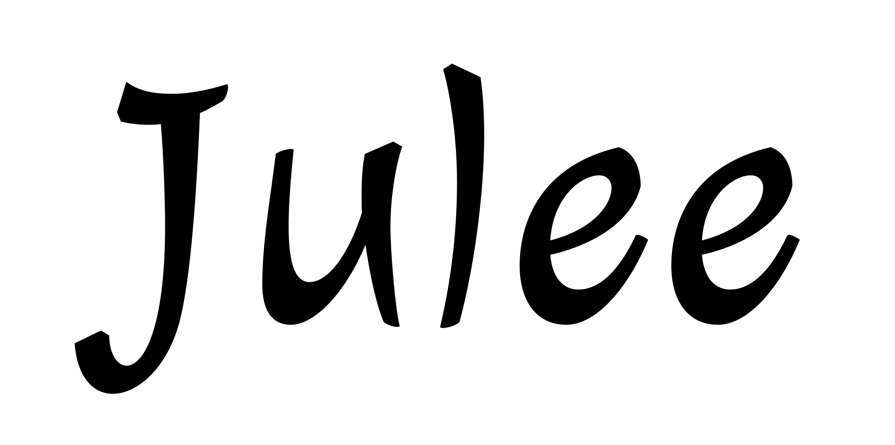
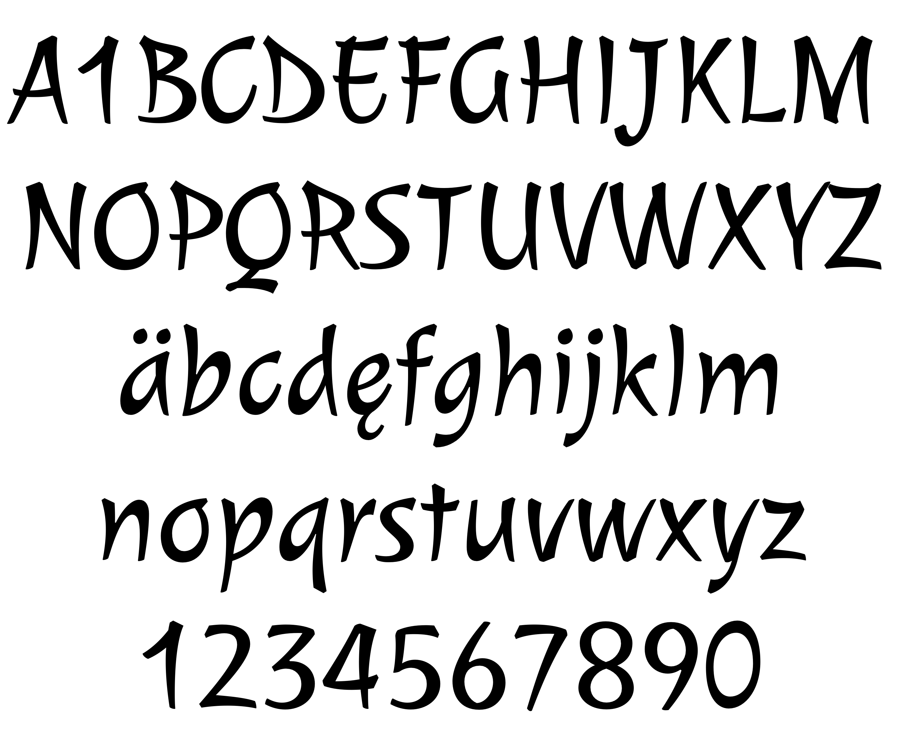

### Julee

The peculiarity of this typography lies in its curved structures and strokes, which are developed on it by getting thinner and sharper as if they were being typed using a metallic and bevel-edged point.

The visual mark characteristic of Julee is a casual cursive-like type, yet balanced due to the tidy proportions of its signs.

### Designer

* Julián Rodríguez Tunni

### License

Licensed under the [*SIL Open Font License, 1.1*](https://scripts.sil.org/OFL); you may not use this file except in compliance with the License.

To contribute to the project contact Julián Rodríguez Tunni > juliantunni@gmail.com
